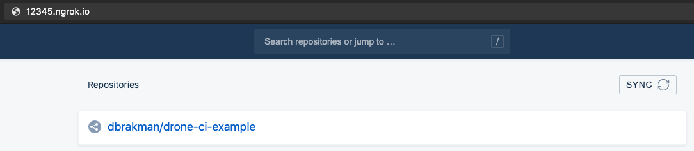

# drone-ci-example
Follows the Getting Started guide at https://docs.drone.io/server/provider/github/ for running a local Drone Server and Runner on Mac OS.

# Overview of Terms
The "Drone Server" provides a nice web GUI for seeing what CI/CD is happening. You register it with your GitHub account as an OAuth application that knows to kick off build-test-deploy pipelines whenever you make PRs, etc.

"Drone Runners" do the heavy lifting of executing your pipelines. They listen to the "Drone Server", to which they authenticate with an arbitrary shared secret, to download your code and receive instructions for what to do with your code.

# Authorizing the Drone Server with your GitHub
1. Install [ngrok](https://ngrok.com/) and make an account with them
2. In a dedicated terminal window or tmux session, run `ngrok http 80` (and don't cancel it with ^C). This will expose port 80 on your computer to the wider internet via a random URL of ngrok's choosing. The output of that function should look like:
```
ngrok by @inconshreveable     (Ctrl+C to quit)

Session Status                online
Account                       David Brakman (Plan: Free)
Version                       2.3.35
Region                        United States (us)
Web Interface                 http://127.0.0.1:4040
Forwarding                    http://12345.ngrok.io -> http://localhost:80
Forwarding                    https://12345.ngrok.io -> http://localhost:80
```
The http forwarding url (http://12345.ngrok.io) will be where you, and github, access the Drone server you're about to make.

3. In the Developer Settings for your personal GitHub account, [register a new OAuth application](https://docs.github.com/en/developers/apps/creating-an-oauth-app). 
4. Copy the Client ID and Client Secret to a file on your computer.
5. Specify "Homepage URL": http://12345.ngrok.io
6. Specify "Authorization callback URL": http://12345.ngrok.io/login
7. In a new terminal session, finish the instructions through [Start the Server](https://docs.drone.io/server/provider/github/#start-the-server)
8. **Visit http://12345.ngrok.io in your browser** and click Activate on any GitHub repo of yours.
   It should look like 

# Executing Build/Test/Deploy Instructions with Runners
At time of writing, Drone's docs would say "Install Runners", point you to a menu of 6 different runner types, and tell you that the Docker Runner won't work on Mac (but it will). Foolishly, I tried using the "Exec Runner", which I couldn't get to connect to the Drone Server, write logs, or do anything. Don't mess with any of that stuff.

1. Follow the Docker Runner instructions at <https://docs.drone.io/runner/docker/installation/linux/>.
